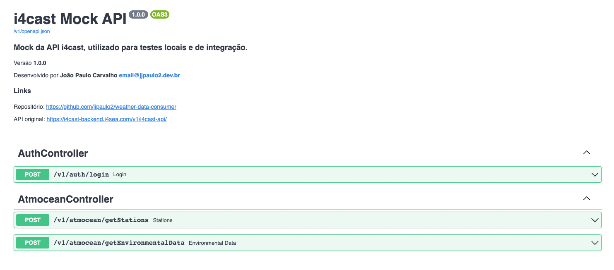

Possui apenas os endpoints necessário para fazer as ações que o projeto se propões.

#### Stack

- FastAPI
- Pydantic

### Executando com docker

Faça o build da imagem.

```shell
$ docker build --no-cache -t i4cast-mock-api .
```

Execute o módulo dentro do container.

```shell
docker run \
    -dp 8880:8880 \
    i4cast-mock-api
```

Navegue para [http://0.0.0.0:8880/v1/i4cast-api](http://0.0.0.0:8880/v1/i4cast-api).

### Executando sem docker

Garanta que você tem a versão 3.11 do python instalada.

```shell
$ pyenv install $(pyenv local)
```

Instale as dependências com o Poetry, depois entre no virtualenv.

```shell
$ poetry install
$ poetry shell
```

Para executar em modo de desenvolvimento, rode o comando abaixo.

```shell
$ python ./i4cast_mock_api/app.py
```

Para executar em modo de produção, rode o script abaixo.

```shell
$ sh ./run.sh
```

Navegue para [http://0.0.0.0:8880/v1/i4cast-api](http://0.0.0.0:8880/v1/i4cast-api).
